# 📺 Kidflix

تطبيق حديث لبث الفيديو مخصص للأطفال، مصمم لتوفير محتوى آمن وترفيهي للأطفال. تم بناؤه بواجهة جذابة وملونة مع تنقل سهل وبديهي مناسب للمستخدمين الصغار.

## ✨ المميزات

- **محتوى مناسب للفئات العمرية**: فيديوهات منتقاة ومنظمة حسب الفئات العمرية (3-5، 5-7، 7-12 سنة)
- **تجربة شخصية**: ملفات تعريف المستخدمين مع تفضيلات قابلة للتخصيص
- **تصنيفات تفاعلية**: محتوى تعليمي، ترفيهي، موسيقي، وحيوانات
- **ميزات اجتماعية**: إعجاب، تعليق، مشاركة، وإعادة مزج الفيديوهات
- **مصادقة آمنة**: تسجيل الدخول بالبريد الإلكتروني/كلمة المرور مع خيارات تسجيل الدخول الاجتماعي (Google، Facebook، Apple)
- **إدارة الاشتراكات**: خطط اشتراك مرنة بناءً على عمر الطفل
- **طرق دفع متعددة**: دعم بطاقات الائتمان/الخصم، PayPal، Google Pay، و Apple Pay
- **ضوابط أبوية**: إعدادات للمناطق الزمنية، قيود العمر، وتصفية المحتوى

## 📱 لقطات الشاشة

### التعريف بالتطبيق والمصادقة

| شاشة البداية | التعريف 1 | التعريف 2 | التعريف 3 |
|:---:|:---:|:---:|:---:|
| 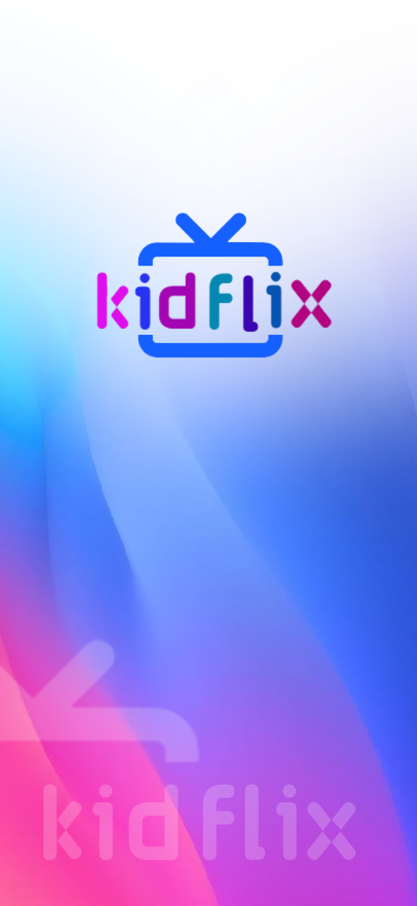 | 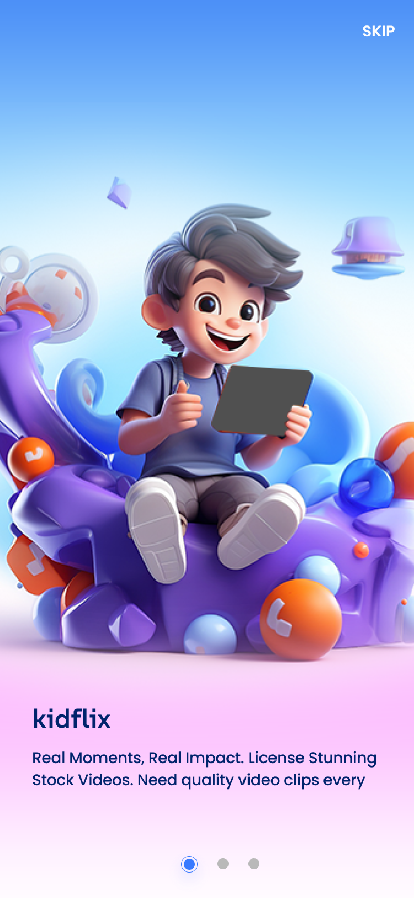 | 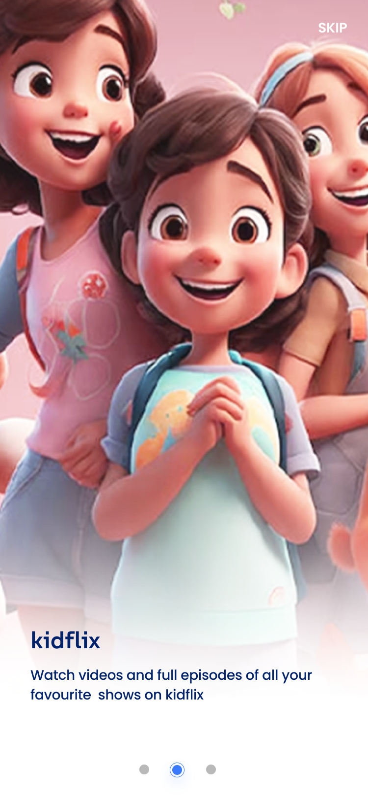 | 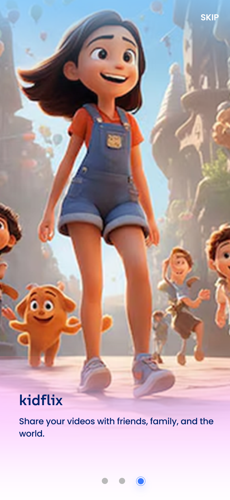 |

| تسجيل الدخول | التسجيل | التحقق | الاشتراك |
|:---:|:---:|:---:|:---:|
| 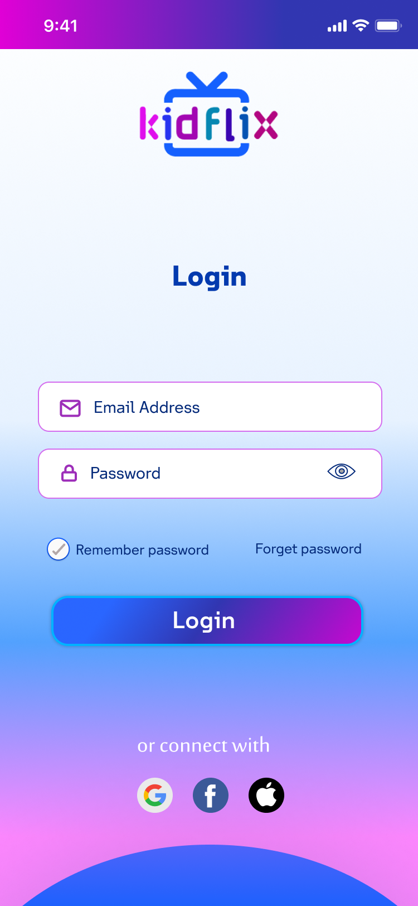 | 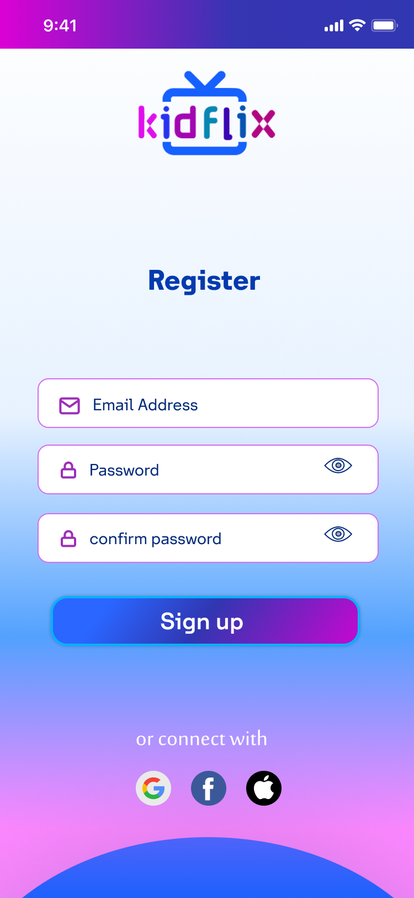 | 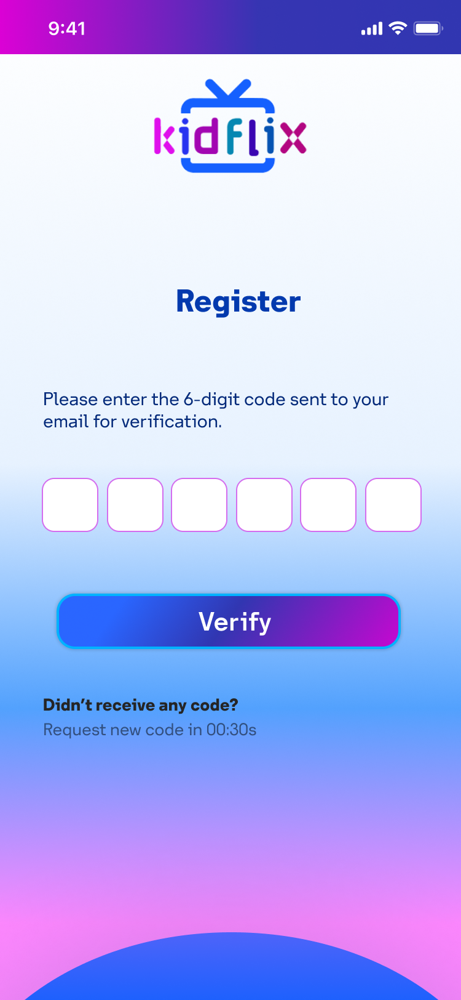 | 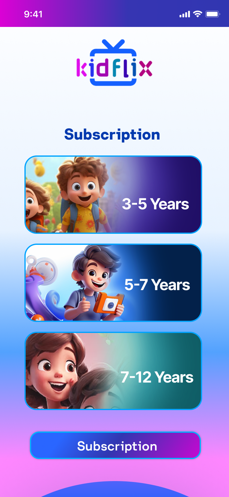 |

### الدفع والإعداد

| طريقة الدفع 1 | طريقة الدفع 2 | اختيار الفئات 1 | اختيار الفئات 2 |
|:---:|:---:|:---:|:---:|
| 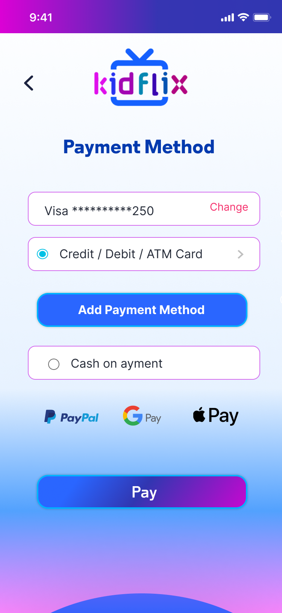 | 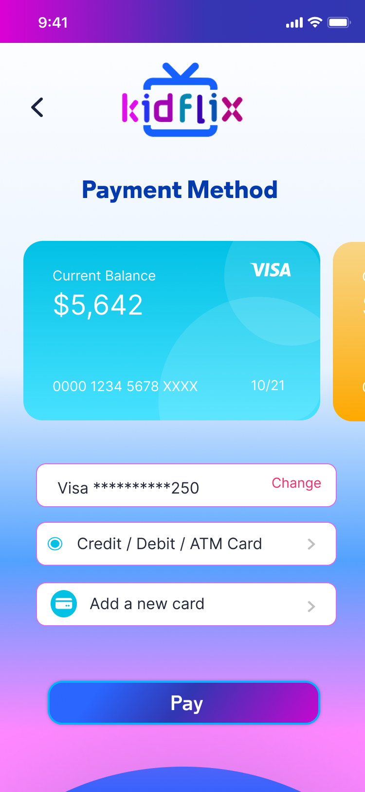 | 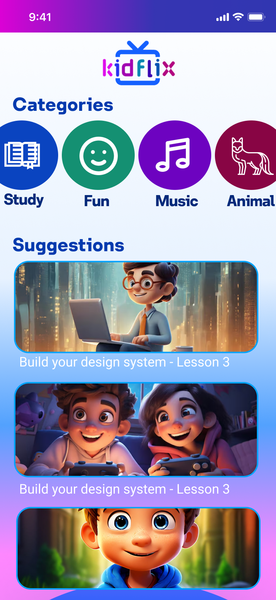 | 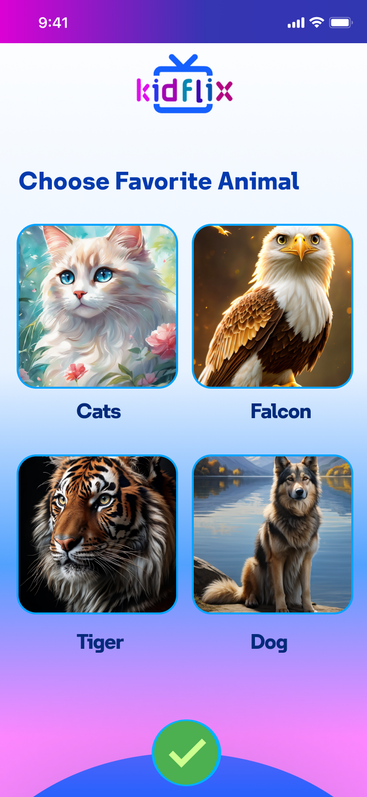 |

### الميزات الرئيسية

| اختيار الفئات 3 | المرح | قائمة الفيديوهات | مشغل الفيديو |
|:---:|:---:|:---:|:---:|
| 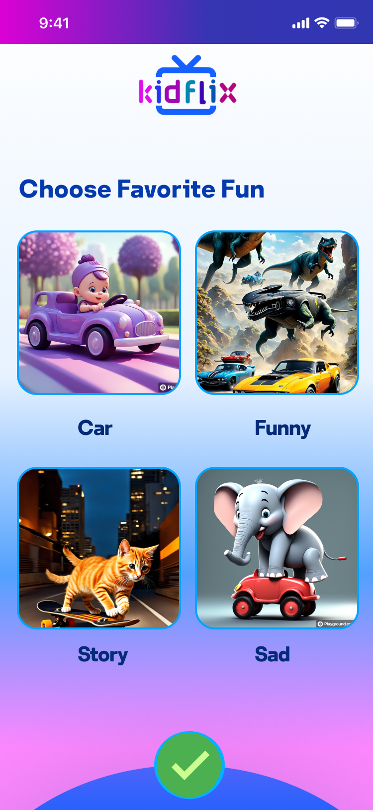 |  | 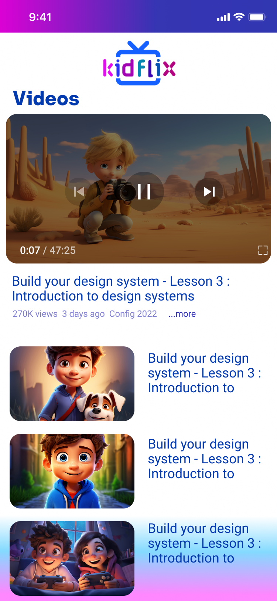 | 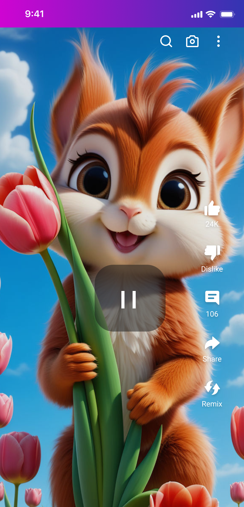 |

### الإعدادات والملف الشخصي

| الإعدادات | الملف الشخصي |
|:---:|:---:|
| 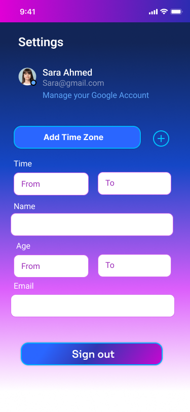 | 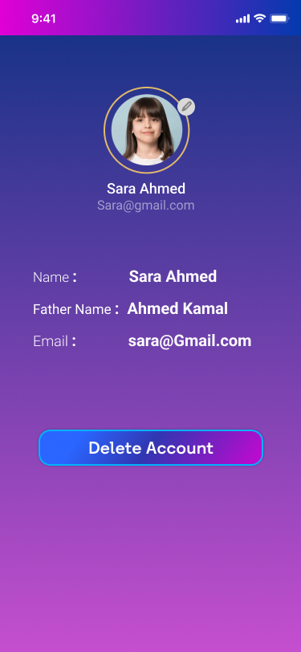 |

## 🎯 النقاط المميزة

### تجربة المستخدم
- **واجهة ملائمة للأطفال**: تدرجات لونية زاهية (من الوردي إلى الأزرق) مع عناصر تصميم مرحة
- **تنقل سهل**: أزرار كبيرة وواضحة مع أيقونات تصنيف بديهية
- **تفاعل بصري**: شخصيات متحركة ورسوم توضيحية نابضة بالحياة في جميع أنحاء التطبيق

### إدارة المحتوى
- **فيديوهات منتقاة**: محتوى تعليمي وترفيهي مفلتر حسب مناسبته للعمر
- **تصنيف ذكي**: محتوى منظم حسب الدراسة، المرح، الموسيقى، والحيوانات
- **تخصيص**: توصيات مخصصة بناءً على تفضيلات المستخدم

### الأمان والسلامة
- **التحقق من البريد الإلكتروني**: رمز تحقق مكون من 6 أرقام لأمان الحساب
- **خيارات مصادقة متعددة**: دعم تسجيل الدخول بالبريد الإلكتروني/كلمة المرور والدخول الاجتماعي
- **ضوابط أبوية**: إعدادات شاملة لإدارة تجربة المشاهدة للأطفال

### تكامل الدفع
- **خيارات مرنة**: بطاقات الائتمان/الخصم، PayPal، Google Pay، Apple Pay
- **معاملات آمنة**: معالجة دفع متوافقة مع معايير PCI
- **عرض الرصيد**: رؤية واضحة لرصيد الحساب

## 🛠️ التقنيات المستخدمة

- **المنصة**: iOS/Android (تطبيق متعدد المنصات)
- **UI Framework**: واجهة مستخدم حديثة مع خلفيات متدرجة ومكونات مخصصة
- **Authentication**: البريد الإلكتروني/كلمة المرور + OAuth (Google, Facebook, Apple)
- **Payment Gateway**: تكامل مع عدة مزودي خدمات الدفع
- **Video Player**: مشغل فيديو مخصص مع عناصر تحكم في التشغيل
- **State Management**: إدارة حالة التطبيق بكفاءة عالية
- **API Integration**: تكامل مع واجهات برمجية خلفية
- **Local Storage**: تخزين محلي للبيانات والتفضيلات
- **Push Notifications**: إشعارات فورية للمحتوى الجديد

## 📋 تدفق المستخدم

1. **التعريف بالتطبيق**: ثلاث شاشات لتقديم ميزات التطبيق
2. **المصادقة**: تسجيل الدخول أو التسجيل مع التحقق من البريد الإلكتروني
3. **الاشتراك**: اختيار خطة الاشتراك المناسبة للعمر
4. **الدفع**: اختيار وتكوين طريقة الدفع
5. **التخصيص**: اختيار الحيوانات والتصنيفات المفضلة
6. **التصفح**: استكشاف التصنيفات وتوصيات الفيديو
7. **المشاهدة**: الاستمتاع بالفيديوهات مع ميزات تفاعلية (إعجاب، تعليق، مشاركة)

## 🎨 مميزات التصميم

- **لوحة الألوان**: تدرجات نابضة بالحياة من الوردي (#FF006E) إلى الأزرق (#4F46E5)
- **الخطوط**: خطوط عريضة ومستديرة لقراءة سهلة وملائمة للأطفال
- **الأيقونات**: أيقونات مخصصة للتصنيفات والإجراءات
- **الرسوم المتحركة**: انتقالات سلسة وتفاعلات دقيقة جذابة
- **الرسوم التوضيحية**: تصاميم شخصيات مرحة في جميع أنحاء التطبيق

## 🔒 ميزات الأمان

- تصفية المحتوى المناسب للعمر
- مصادقة آمنة مع التحقق من البريد الإلكتروني
- إعدادات الضوابط الأبوية
- قيود المنطقة الزمنية
- إدارة الحساب مع خيار الحذف

## 💳 خطط الاشتراك

- **3-5 سنوات**: محتوى مصمم لمرحلة ما قبل المدرسة
- **5-7 سنوات**: محتوى تعليمي للمرحلة الابتدائية المبكرة
- **7-12 سنة**: محتوى للمرحلة الابتدائية العليا والمتوسطة

## 🤝 الميزات الاجتماعية

- الإعجاب بالفيديوهات (تفاعل يصل إلى 24 ألف)
- التعليق على المحتوى (مثال: 106 تعليق)
- مشاركة الفيديوهات مع الأصدقاء والعائلة
- ميزة إعادة المزج للتفاعل الإبداعي

## 📦 البنية التقنية

### Frontend
- تصميم responsive متجاوب مع جميع أحجام الشاشات
- Component-based architecture لسهولة الصيانة
- Custom UI components للحصول على تصميم فريد

### Backend Integration
- RESTful API للتواصل مع الخادم
- Real-time updates للمحتوى الجديد
- Secure authentication tokens

### Performance
- Image optimization لتحميل سريع
- Video streaming optimization
- Caching strategy للأداء الأمثل

---

**ملاحظة**: تم تصميم Kidflix مع وضع سلامة الأطفال وراحة البال للآباء كأولويات قصوى، مما يوفر منصة آمنة وجذابة لترفيه وتعليم الأطفال.
